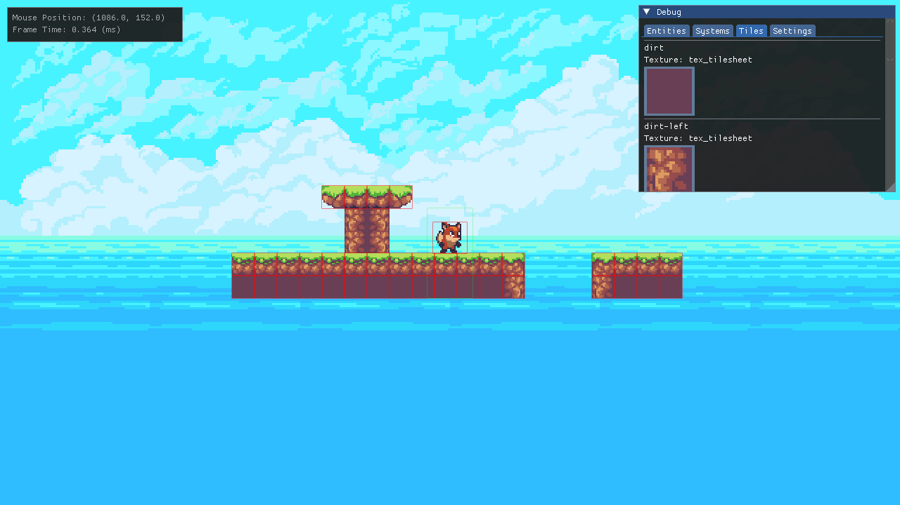

<!-- [![header][header-url]][header-link] -->

# Untitled Platformer

> This is a work-in-progress 2D Platformer, built using SFML & DearImGui in C++.

I've decided to put the past year of learning experience to good use and finally build something resembling a game!
The main aim of this project is to build out a small game experience and all the associated engine capabilities and tooling that are required on the way. I think when I got started trying to learn engine programming, I fell into the trap of thinking that the general purpose game-engines of the world were the rule as opposed to the exception, but more recently it's become clear to me that thats simply not the case.

I've had a great time putting this together over the past couple of weeks, and I'm really looking forward to taking this project wherever it might go. For now I'm focused on getting something playable together, a main menu and some demo levels, before deciding on any further direction to head in.

I plan to write a few things about the development of this project and my design choices [here](https://samhaskell.dev/) if you're interested.

## Features

* Engine
  * Component based architecture (not pure ECS, but I am currently looking to switch to a more data-oriented backend)
  * Scene switching and deserialisation from custom level json specification
  * Asset loading at startup from configurable asset manifest

* Gameplay
  * Satisfying and responsive character controller
  * Animated sprite and animation state switching
  * Swept AABB (interpolated) collision detection
  * Box-based camera system with damped player tracking

* Tooling
  * Debug overlay for easy debugging of game during runtime
  * Early exploration for a level editor, potentially bundled in with main game executable
 
## Planned Features

* Scripting integration (Lua or Native C++)
* Level Editor available as an in-engine scene, so it can be bundled with the app for player content authoring
* Action-Key rebinding and storage of player preferences

## Installation

As of right now, this project only builds on MacOS. To get started just clone the repo and run premake5 gmake on the root directory.

I am not aware of any easy/reliable way to compile SFML based games for WASM so unfortunately I can't provide a web build. In the future I may decide to rip out the SFML stuff and roll my own batched OpenGL renderer, so WASM could be an option then.

## Built With

* [SFML](https://www.sfml-dev.org/) - Simple & Fast Multimedia Library
* [DearIMGUI](https://github.com/ocornut/imgui) - Immediate-Mode GUI
